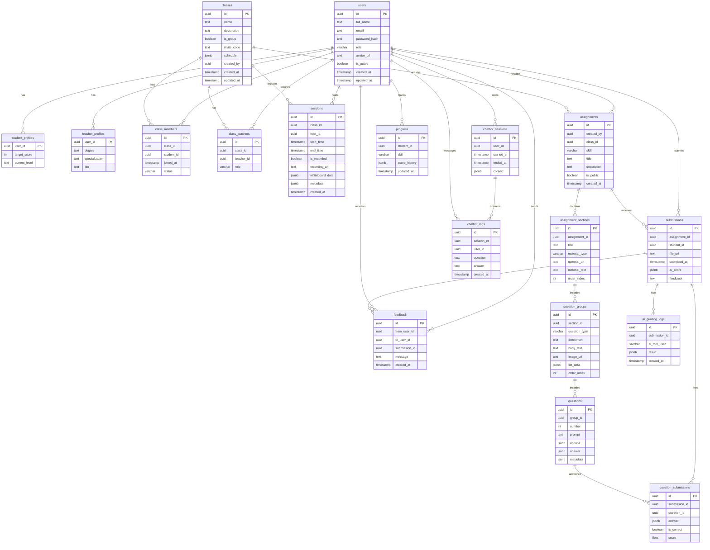

# Idest
### Ref
<ul>
  <li><a href="https://github.com/livekit/livekit">LiveKit (WebRTC SFU)</a></li>
  <li><a href="https://dolacademy.vn">Dol</a></li>
  <li><a href="https://zim.vn">Zim</a></li>
  <li><a href="https://study4.com">Study4</a></li>
</ul>

// need update diagram

